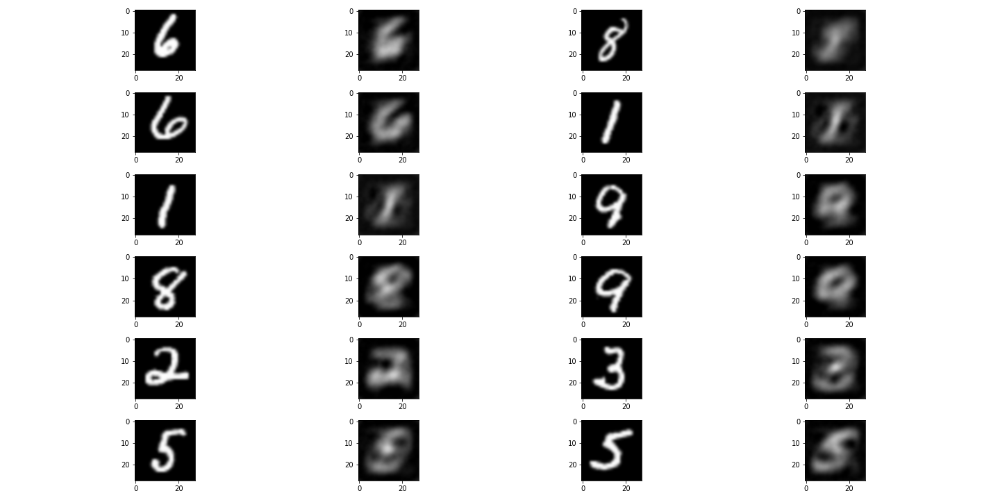
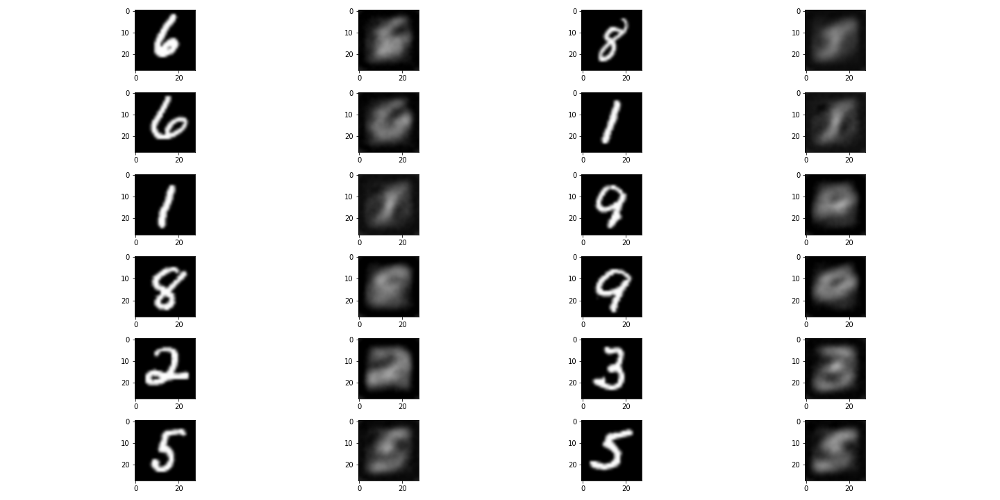
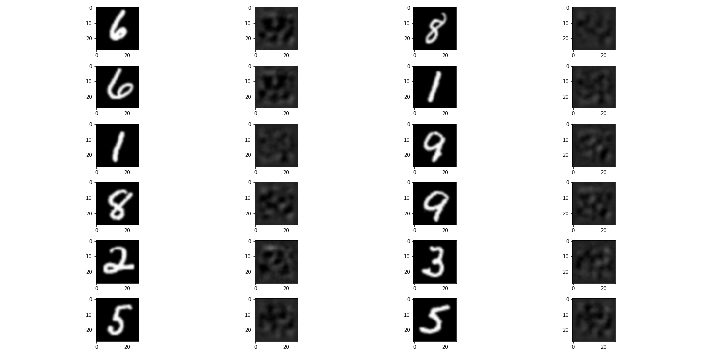

## Code for Multiple Activations and Labels Mix Mechanism for Split Learning
---
## Directory of Source Code
|--**src**\
|--------**alg**: different algorithms codes\
|--------**model**: models used to train\
|--------**dataprocess**: data preprocess\
|--------**tools**: some tools used in our codes\
|--------**dist**: algorithms in real-world setting(beta)\
|--**results**\
|--------**Figures**: experimental results\
|--------**reconstruction**: experimental results of data reconstrution

---
##  Main Commend Used To Execute
> + (non-split algorithm) python non-split.py --gpu 0 --name yourname
> + (FedAvg algorithm) python fl.py --gpu 0 --name yourname
> + (SplitNN algorithm) python sl.py --gpu 0 --name yourname
> + (DP-SL algorithm) python sl.py --gpu  0 --name yourname --dp
> + (NopeekNN algorithm) python dcor.py --gpu 0 --name yourname
> + (3-labels MixSL algorithm) python MixSL.py --gpu 0 --name yourname
> + (m-labels MixSL algorithm) python multi_mixsl.py --gpu 0 --name yourname --mix_num m
> + (Auto-MixSL algorithm) python auto_multi_mixsl.py --gpu  0 --name yourname --mix_num m
---
## Some important configurations
> +  --epochs. The number of epochs to execute. E.g., --epochs 200
> + --gpu Assigning device (id) to execute programs. E.g., --gpu 0
> + --name. The file tag to identify experiments. E.g., --name test
> + --mix_num. Setting how many labels/activations used to mix. E.g., --mix_num 3
> + --dp. Executing DP-SL program. E.g., --dp
> + --cifar100. Training models on CIFAR-100
> + --google_split. Partitioning data using the strategy introduced in google's paper.
> + --model. Assgining model. E.g., --model ResNet18

---
## Privacy-Preserving Experiments
.png)

**Fig.1 performance comparison with baselines**

## Data Reconstruction Experiments

**Fig.2 Case of data reconstraction (activations output from models trained by 3-labels MixSL)**

**Fig.3 Case of data reconstraction (activations output from models trained by 4-labels MixSL)**

**Fig.4 Case of data reconstraction (activations output from models trained by 5-labels MixSL)**